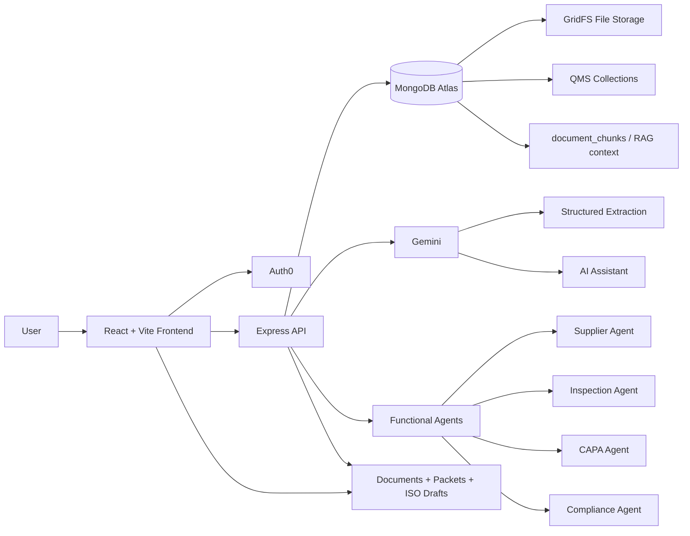

# Inspectra

How many safe products are put at risk because medical-device compliance is still managed through manual spreadsheets, scattered PDFs, and missed follow-ups? And how many hours are  teams losing every week just to assemble documents, trace lots, and prepare for audits by hand?

Inspectra is a quality-management and inspection-readiness workspace for medical-device teams. It brings together supplier records, inspection records, lot traceability, nonconformance reports (NCRs), and corrective and preventive actions (CAPAs) into one workflow aligned with ISO 13485, the international quality-management standard for medical devices. It also supports document storage, evidence traceability, AI-assisted analysis, and exportable audit packets for inspection prep.

## What It Does

1. Upload supplier, inspection, lot, NCR, CAPA, and quality-system PDF documents and store the original files in MongoDB/GridFS 

2. Convert unstructured documents into structured records such as supplier qualifications, inspection results, lot traceability, nonconformances, and CAPAs.

3. Link extracted data back to the exact source documents so every field and action can be traced to its evidence.

4. Organize the extracted information into a QMS workflow aligned with ISO 13485

5. Detect compliance gaps by identifying missing records, overdue requalifications, failed inspections, open NCRs, overdue CAPAs, and weak traceability.

6. Rank the highest-priority issues using our multi-agent system (Supplier Agent, Inspection Agent, CAPA Agent, and Compliance Agent).

7. Support question answering with RAG by retrieving relevant MongoDB-stored document chunks and structured QMS context for the AI assistant.

8. Generate inspection-ready outputs such as supplier inspection packets and ISO 13485 draft documents including the Approved Supplier List, Requalification Plan, Incoming Inspection Packet, NCR and CAPA Register, and Management Review Summary.


## Stack

- Frontend: Vite, React, TypeScript, Tailwind, Radix UI, React Query
- Backend: Express, MongoDB, GridFS
- Auth: Auth0
- AI: Gemini-backed assistant and document extraction

## Tech Stack Diagram



High-level flow:

- Auth0 secures org-scoped login and backend JWT verification
- React frontend calls the Express API for QMS data and document actions
- MongoDB stores records, GridFS files, and RAG chunks
- Gemini powers extraction and assistant responses using retrieved Mongo-backed context
- Functional agents generate prioritized compliance and quality actions

## Sponsors

### Auth0

- authenticate users with JWT-based backend protection
- scope data access by organization so each company only sees its own records
- protect documents, assistant requests, and QMS APIs behind verified bearer tokens

Relevant code:

- [server/auth.js](/Users/anishka/Documents/GitHub/YHacks/inspectra/server/auth.js)
- [src/hooks/useAuth.tsx](/Users/anishka/Documents/GitHub/YHacks/inspectra/src/hooks/useAuth.tsx)

### Gemini

- extract structured supplier, inspection, lot, NCR, and CAPA information from uploaded documents
- support the QMS-aware assistant experience
- help convert unstructured PDFs into auditable operational records

Relevant code:

- [server/rag.js](/Users/anishka/Documents/GitHub/YHacks/inspectra/server/rag.js)
- [server/assistant.js](/Users/anishka/Documents/GitHub/YHacks/inspectra/server/assistant.js)

### MongoDB

- store QMS entities such as suppliers, parts, lots, inspections, NCRs, CAPAs, and documents
- store uploaded file bytes in GridFS
- store extracted document chunks for retrieval
- support retrieval-augmented generation by combining stored chunks and structured records with Gemini

MongoDB is central to the RAG flow:

- documents are uploaded and stored
- content is chunked and saved into `document_chunks`
- retrieval pulls relevant chunks and record context
- Gemini uses that evidence to answer questions or extract structured data

Relevant code:

- [server/db.js](/Users/anishka/Documents/GitHub/YHacks/inspectra/server/db.js)
- [server/qms.js](/Users/anishka/Documents/GitHub/YHacks/inspectra/server/qms.js)
- [server/rag.js](/Users/anishka/Documents/GitHub/YHacks/inspectra/server/rag.js)

## AI Agents

Inspectra uses functional agents tied to specific quality workflows instead of one generic assistant.

Current agent roles:

- `Compliance Agent`
  - ranks audit and quality risks
  - flags overdue or high-priority compliance issues
- `Supplier Agent`
  - tracks supplier qualification and requalification risk
  - surfaces supplier drift, certificate expiry, and oversight gaps
- `Inspection Agent`
  - interprets incoming inspection outcomes
  - escalates failed inspections into actionable issues
- `CAPA Agent`
  - groups recurring failures and supports corrective-action tracking
- `AI Assistant`
  - answers questions across the current QMS data and document context

Relevant code:

- [server/agents](/Users/anishka/Documents/GitHub/YHacks/inspectra/server/agents)
- [server/agent-runs.js](/Users/anishka/Documents/GitHub/YHacks/inspectra/server/agent-runs.js)
- [src/pages/Agents.tsx](/Users/anishka/Documents/GitHub/YHacks/inspectra/src/pages/Agents.tsx)

## Core Pages

- `Dashboard`: live priority actions
- `Documents`: uploaded files, inspector packets, ISO draft exports
- `Parts & Suppliers`: part and supplier records
- `Inspections`: incoming inspection records
- `NCRs`: nonconformance workflow
- `CAPA`: corrective and preventive actions
- `Compliance`: deadlines, risk prioritization, compliance agent
- `AI Assistant`: QMS-aware assistant

## Project Structure

```text
src/
  pages/        app screens
  components/   UI and layout
  hooks/        auth + QMS data hooks
  lib/          API client
  utils/        PDF export utilities

server/
  index.js                  Express API
  db.js                     Mongo connection
  qms.js                    QMS record operations
  rag.js                    document extraction / processing
  assistant.js              AI assistant backend
  auth.js                   Auth0 JWT verification
  seed-demo-data.js         demo Mongo data seeding
  generate-sample-documents.js  sample PDF generation
```

## Requirements

- Node 20+
- npm
- MongoDB Atlas or local MongoDB
- Auth0 tenant and application
- Gemini API key

## Environment

Create `.env.local` in the project root.

### Required backend variables

```env
MONGODB_URI=
MONGODB_DB_NAME=inspectra
GEMINI_API_KEY=
PORT=3001
AUTH0_ISSUER_BASE_URL=
AUTH0_AUDIENCE=
```

### Required frontend variables

```env
VITE_AUTH0_DOMAIN=
VITE_AUTH0_CLIENT_ID=
VITE_AUTH0_AUDIENCE=
```

### Optional

```env
GEMINI_MODEL=gemini-2.5-flash
VITE_API_BASE_URL=
```

Notes:

- In local dev, leave `VITE_API_BASE_URL` unset if you want Vite to proxy `/api` to `127.0.0.1:3001`.
- If Auth0 only gives you `org_id`, the UI can still use that for the active workspace label.

## Auth0 Setup

Inspectra expects Auth0 access tokens for a custom API, not the Auth0 Management API.

Minimum setup:

1. Create an Auth0 API for Inspectra
2. Use that API identifier for both:
   - `AUTH0_AUDIENCE`
   - `VITE_AUTH0_AUDIENCE`
3. Create an Auth0 Application for the frontend
4. Configure callback/logout URLs for local dev:
   - `http://127.0.0.1:8080/`
5. If using Organizations, enable them on the client and connection

## Install

```bash
npm install
```

## Run Locally

Terminal 1:

```bash
npm run server
```

Terminal 2:

```bash
npm run dev
```

Open:

- Frontend: `http://127.0.0.1:8080`
- Backend health: `http://127.0.0.1:3001/api/health`

## Available Scripts

```bash
npm run dev
npm run server
npm run build
npm run preview
npm run lint
npm run test
npm run test:watch
npm run seed:demo-qms
```

## Demo Data

To seed demo QMS data into MongoDB:

```bash
npm run seed:demo-qms
```

If your seed script accepts custom flags in your local version, use them to match your Auth0 org/user scope.

## Generate Sample PDFs

To create realistic demo source documents you can upload into Inspectra:

```bash
node server/generate-sample-documents.js
```

Or with a custom org name/output directory:

```bash
node server/generate-sample-documents.js --org-name "Org Test Medical" --out-dir demo-documents
```

This generates PDFs such as:

- supplier certificate
- incoming inspection report
- nonconformance report
- CAPA follow-up plan
- lot traceability record

## Documents Workflow

The `Documents` page supports three main uses:

1. Uploaded controlled/source documents
2. Supplier inspection packets
3. ISO draft exports

Current ISO draft exports:

- Approved Supplier List
- Supplier Requalification Plan
- Incoming Inspection Packet
- NCR and CAPA Register
- Management Review Summary

Current supplier packet export:

- Supplier inspection packet PDF aligned to supplier qualification and external-provider oversight

## Data Model

Main Mongo collections:

- `documents`
- `document_chunks`
- `suppliers`
- `parts`
- `lots`
- `devices`
- `device_lots`
- `inspections`
- `ncrs`
- `capas`
- `agent_runs`
- `audit_logs`
- `version_snapshots`

GridFS stores uploaded file bytes.

## Notes

- The assistant and document-processing paths depend on a valid Gemini API key.
- Auth-protected routes depend on a valid Auth0 JWT audience setup.
- Some PDF utilities use `jspdf`; Vite may warn about chunk size during build, but the app still builds successfully.

## Build

```bash
npm run build
```

## License

Private hackathon project.
